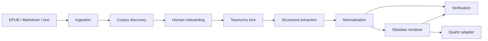

# Architecture

## Stage graph

Each arrow crosses a persisted contract. A later stage does not infer missing upstream state from generated Markdown.

## Contracts

### Ingestion

Inputs are immutable source bytes plus `plot-tools.yml`. Outputs are a source manifest and ordered `Segment` JSONL records. Segment IDs combine source ID, scoped ordinal, and content hash. EPUB ingestion follows OPF spine order rather than archive or manifest order.

### Discovery

Discovery receives the locked starter ontology and a deterministic stratified sample. It returns corpus profile notes, evidenced category proposals, passage kinds, and relationship predicates. It writes a decision draft but cannot modify the taxonomy.

### Onboarding

A decision must classify every proposal. Categories receive definitions, inclusion/exclusion criteria, attributes, folders, and templates. Non-category structures require an explicit target. Applying decisions writes both readable YAML and a hash-bearing JSON lock.

### Extraction

Every segment is an independent structured generation request. A bounded worker pool fans requests out up to `processing.concurrency`, waits for in-flight work on failure, and reconciles successful responses into source order. The provider key is stable (`extract:<segment-id>`), enabling recorded responses. Extraction refuses a taxonomy whose current hash differs from the lock. One parsed response is persisted in `.plot-tools/raw/` and one line in `data/extractions.jsonl`.

### Normalization

Normalization is deterministic and provider-independent. Exact normalized identity inside a category is merged. An alias merges only when it identifies one owner. Ambiguity, conflicting attributes, and unresolved endpoints become review issues; no fuzzy score silently changes identity.

### Canonical graph

Entities, claims, relationships, passages, and open questions are separate records. Every factual or quoted record carries source ID, segment ID, scoped ordinal, locator, and optional excerpt. Stable IDs derive from semantic inputs rather than array position where possible.

### Rendering

The Obsidian renderer is a pure projection of canonical data and publication settings. It empties and rebuilds the output directory, allocates collision-safe paths, emits generic category-driven pages, and hashes relative paths plus bytes. Repeating a render over identical canonical input produces the same hash.

### Quartz

Quartz remains an output adapter, not a source of truth. The adapter clones pinned branch `v5` into `.plot-tools/quartz`, runs the official noninteractive Obsidian setup, installs configured plugins, builds, and copies static output to `site/public`.

## Trust boundaries

Narrative source text is untrusted prompt data. System prompts explicitly prohibit following source instructions. Provider output is untrusted until Zod parsing, taxonomy validation, exact-evidence checks, endpoint resolution, and provenance checks pass. Raw responses are never used directly by the renderer.

## Extension points

- Add a source parser by producing ordered `Segment` records.
- Add a model provider by implementing `StructuredProvider`.
- Extend taxonomy through onboarding rather than hard-coded extractor branches.
- Add a publisher from canonical JSONL without changing extraction.
- Add deterministic gates as `GateResult` records; blocking semantics remain centralized in the verification report.
