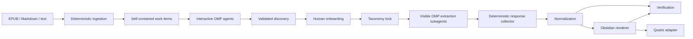

# Architecture

## Stage graph

Each arrow crosses a persisted contract. A later stage does not infer missing upstream state from generated Markdown.

## Contracts

### Ingestion

Inputs are immutable source bytes plus `plot-tools.yml`. Outputs are a source manifest and ordered `Segment` JSONL records. Segment IDs combine source ID, scoped ordinal, and content hash. EPUB ingestion follows OPF spine order rather than archive or manifest order.

### Discovery

Discovery preparation receives the starter ontology and a deterministic stratified sample, then writes a self-contained prompt and JSON schema under `.plot-tools/work/`. A visible OMP task agent writes the response. The deterministic collector validates it, writes a decision draft, and cannot modify the taxonomy.

### Onboarding

A decision must classify every proposal. Categories receive definitions, inclusion/exclusion criteria, attributes, folders, and templates. Non-category structures require an explicit target. Applying decisions writes both readable YAML and a hash-bearing JSON lock.

### Extraction

Every segment becomes one self-contained work item. The project OMP skill dispatches visible task subagents in batches no larger than `processing.concurrency`; each writes one JSON response. The collector parses every response with Zod, verifies its segment ID, restores source order, and refuses a taxonomy whose current hash differs from the lock. One validated response is persisted in `.plot-tools/raw/` and one line in `data/extractions.jsonl`. A stable recording key (`extract:<segment-id>`) supports network-free fixture replay without masquerading as a live provider.

### Normalization

Normalization is deterministic and independent of whichever models the interactive OMP session selected. Exact normalized identity inside a category is merged. An alias merges only when it identifies one owner. Ambiguity, conflicting attributes, and unresolved endpoints become review issues; no fuzzy score silently changes identity.

### Canonical graph

Entities, claims, relationships, passages, and open questions are separate records. Every factual or quoted record carries source ID, segment ID, scoped ordinal, locator, and optional excerpt. Stable IDs derive from semantic inputs rather than array position where possible.

### Rendering

The Obsidian renderer is a pure projection of canonical data and publication settings. It empties and rebuilds the output directory, allocates collision-safe paths, emits generic category-driven pages, and hashes relative paths plus bytes. Repeating a render over identical canonical input produces the same hash.

### Quartz

Quartz remains an output adapter, not a source of truth. The adapter clones pinned branch `v5` into `.plot-tools/quartz`, runs the official noninteractive Obsidian setup, installs configured plugins, builds, and copies static output to `site/public`.

## Trust boundaries

Narrative source text is untrusted prompt data. Work-item instructions explicitly prohibit following source instructions. OMP agent output is untrusted until Zod parsing, taxonomy validation, exact-evidence checks, endpoint resolution, and provenance checks pass. Raw responses are never used directly by the renderer. OMP owns model selection, subscription authentication, tool visibility, and subagent session logs; `plot-tools` owns deterministic data contracts.

## Extension points

- Add a source parser by producing ordered `Segment` records.
- Change orchestration by revising the project OMP skill and work-item protocol, not by embedding a model SDK.
- Extend taxonomy through onboarding rather than hard-coded extractor branches.
- Add a publisher from canonical JSONL without changing extraction.
- Add deterministic gates as `GateResult` records; blocking semantics remain centralized in the verification report.
